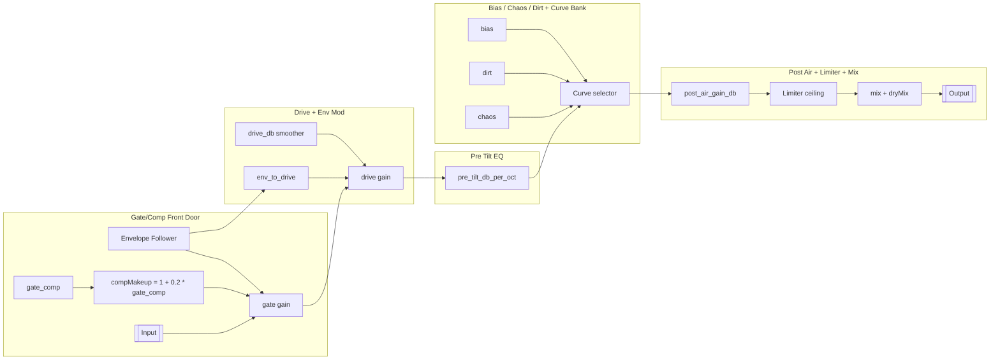

# Dust Press DSP Anatomy — Gate/Comp to Limiter

This is the studio-notebook walkthrough of the DSP spine. Start at the front gate/compressor, ride through the tilt + drive + curve rack, and land in the limiter with a mix-out trim. Inline code refs point to the live implementation so you can tweak with confidence.

## Big-picture flow

1. **Gate/Comp + makeup** → **Drive + Env modulation** → **Pre Tilt EQ** → **Bias/Chaos/Dirt + Curve** → **Post Air EQ** → **Limiter** → **Mix + Output trim**.
2. Envelope follower is tapped early, driving the gate/comp openness and the env-to-drive bump before the shaper.

## Gate/Comp front-door
- `setGateComp` pushes `gateComp` into two places: the gate weighting and a small makeup gain `compMakeup` (`1 + gateComp * 0.2`) to keep tails audible when the gate opens.
- In `update`, `gateGain` lerps between unity and the squared envelope (`envVal^2`) so transients open faster while low-level content stays tucked.
- **Tuning moves:**
  - Raising `gate_comp` lifts tails and also auto-raises makeup; if you crank drive afterwards, back off output trim to keep the limiter relaxed.
  - Leaving `gate_comp` near zero gives you raw pick attack with minimal glue; set `env_to_drive` higher to get dynamic saturation instead of gating.

## Drive + envelope modulation
- `setDriveDb` feeds a smoother so jumps don’t click; the modulated drive at runtime is `driveSmoother.process() + envVal * envDriveAmt`, then converted to linear gain.
- **Tuning moves:**
  - Positive `env_to_drive` makes louder hits push harder into the curves; negative values duck the drive on peaks for steadier tone.
  - Keep drive moderate when using heavy chaos or diode/foldback shapes—otherwise the limiter will work overtime.

## Pre Tilt EQ
- `setPreTilt` sets the slope in dB/oct before shaping, changing which partials hit the curve harder.
- **Tuning moves:**
  - Tilt down (-dB/oct) to keep low-end from smearing the shaper; tilt up to spotlight air before distortion.
  - Pair with `post_air_gain_db` for pre/post tone sculpting: pre emphasizes what distorts, post restores sheen.

## Bias, Chaos, Dirt, and Curve Bank
- Bias offsets the wave before any shaping, changing odd/even emphasis (`curves.setBias`). Dirt adds magnitude-proportional push so curves bite sooner (`curves.setDirt`). Chaos raises both pre-curve jitter and post-curve crackle probability (`curves.setChaos`).
- The curve switch uses `index & 0x3` to pick tanh, cubic, diode, or foldback transfers; chaos injects tiny LCG jitter and occasional clipped spikes for grit.
- **Tuning moves:**
  - More bias = asymmetry; try positive bias with diode for forward mid bite, negative with cubic for spongy sag.
  - Dirt thickens hits before the curve; start around 0.1–0.2 when running low drive for “chewy” push.
  - Chaos 0–2 sprinkles movement; 3–5 gets audible crackle; 6–7 is glitch-land—lower `drive` or raise `mix` to keep it musical.

### Curve snapshots + chaos audio (low/mid/high)
Short composite riff (sine+saw) slammed into each curve with chaos at 1.0 / 3.0 / 6.0. Plots live in-repo; WAVs are rendered locally with `tools/curve_clip_harness.py` (kept out of git to dodge binary creep). Expected filenames land under `docs/media/` so the links below light up when you drop your generated clips next to the plots.

- **Tanh (tape-ish):**
  - Low: [plot](media/tanh_chaos-low.svg) • clip target `media/tanh_chaos-low.wav` — velvet knee stays intact; dirt just warms transients.
  - Mid: [plot](media/tanh_chaos-mid.svg) • clip target `media/tanh_chaos-mid.wav` — faint fizz appears as chaos jitters the knee.
  - High: [plot](media/tanh_chaos-high.svg) • clip target `media/tanh_chaos-high.wav` — hear the hissy crackle break through the silky knee without hard clipping.
- **Cubic (console-ish):**
  - Low: [plot](media/cubic_chaos-low.svg) • clip target `media/cubic_chaos-low.wav` — smooth glue with just a smidge of 3rd-order chew.
  - Mid: [plot](media/cubic_chaos-mid.svg) • clip target `media/cubic_chaos-mid.wav` — upper partials roughen as the cubic shoulder jiggles.
  - High: [plot](media/cubic_chaos-high.svg) • clip target `media/cubic_chaos-high.wav` — grainy spit rides the flatted peaks; keep mix handy.
- **Diode pair:**
  - Low: [plot](media/diode_chaos-low.svg) • clip target `media/diode_chaos-low.wav` — positive lobe bends harder, asymmetry bites without fizz.
  - Mid: [plot](media/diode_chaos-mid.svg) • clip target `media/diode_chaos-mid.wav` — metallic rasp starts; asymmetry makes the rasp favor positive swings.
  - High: [plot](media/diode_chaos-high.svg) • clip target `media/diode_chaos-high.wav` — crackle flares on the positive crest first, leaving negative side comparatively cleaner.
- **Foldback:**
  - Low: [plot](media/foldback_chaos-low.svg) • clip target `media/foldback_chaos-low.wav` — immediate folding gives bell-like sheen without chaos glitter.
  - Mid: [plot](media/foldback_chaos-mid.svg) • clip target `media/foldback_chaos-mid.wav` — folds jitter, adding crystalline shatter and light metallic ring.
  - High: [plot](media/foldback_chaos-high.svg) • clip target `media/foldback_chaos-high.wav` — foldback clang with early crackle onset; metallicity turns industrial fast.

## Post Air EQ
- `setPostAir` adjusts a high-shelf after the shaper (`air.process`), letting you restore or tame highs the shaper exaggerated.
- **Tuning moves:**
  - If chaos crackle feels sharp, pull air down a few dB; if foldback sounds muffled, push air up.

## Lookahead limiter
- `setCeiling` wires straight into `limiter.setCeilingDb`; limiter clamps after post-air, catching peaks from curves/chaos/dirt.
- **Tuning moves:**
  - Set ceiling around -1 to -3 dB for “studio safe” levels; raise dirt/drive until limiter just kisses peaks for polished grit.
  - For raw crunch, set ceiling near 0 and manage level with `out_trim_db` instead of hammering the limiter.

## Mix + Output trim
- Wet/dry mix happens after limiting: `mixed = wet * mix + dry * dryMix`, then `outputTrimDb` scales the result.
- **Tuning moves:**
  - Parallel blend keeps transient snap while letting chaos/foldback live underneath.
  - Use trim to re-level after gate_makeup/drive changes so presets swap consistently.

## Quick tweak recipes
- **Punchy glue:** gate_comp 0.3, env_to_drive +6 dB, cubic curve, dirt 0.1, ceiling -2 dB, mix 60%.
- **Shattered glass:** gate_comp 0.1, drive hot, bias -0.3, foldback, chaos 5, air +2 dB, mix 30% to taste.
- **Tape lean:** gate_comp 0.25, drive mid, bias +0.1, tanh, tilt -1 dB/oct, ceiling -1 dB, mix 70%.
